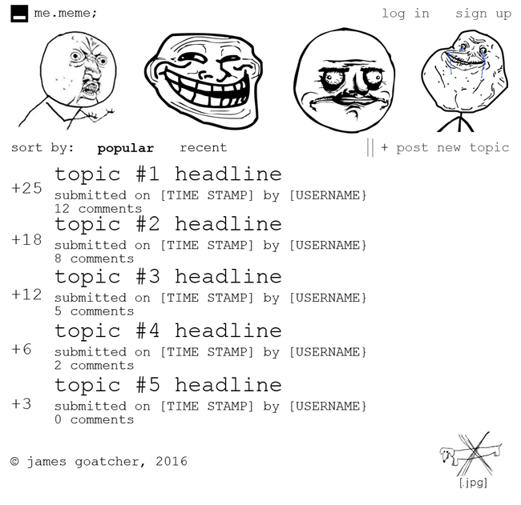
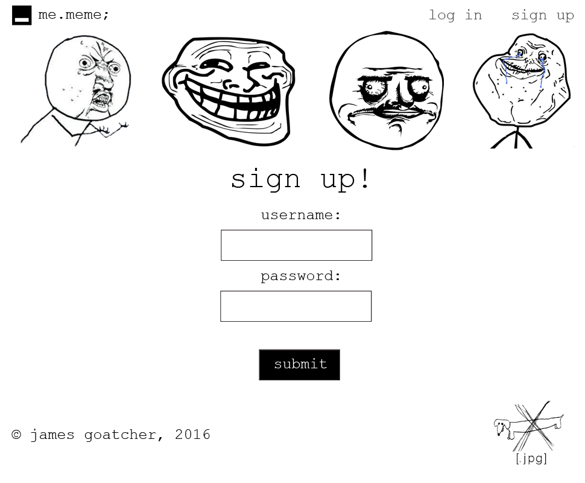
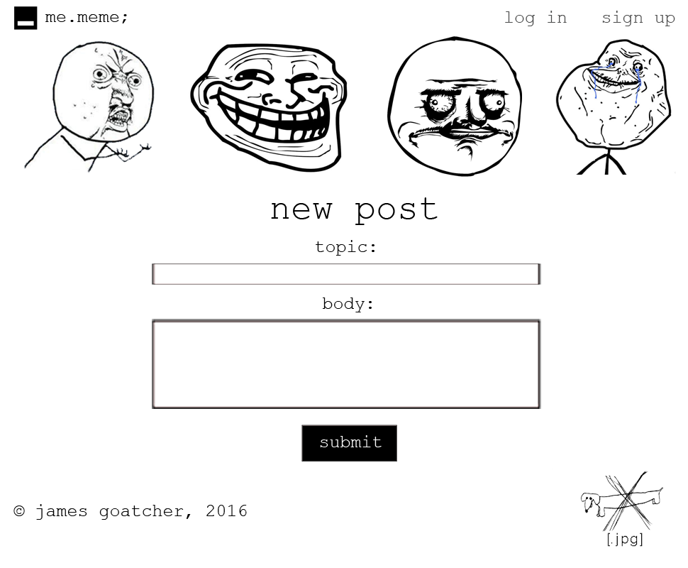
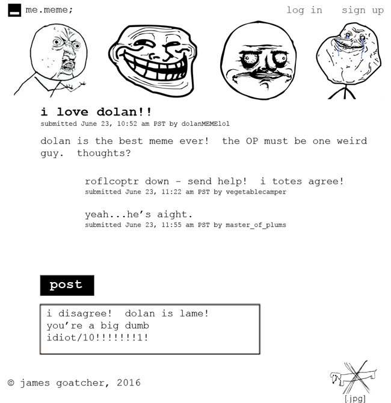

# me.meme - forum

[https://radiant-depths-68561.herokuapp.com/login/title](https://radiant-depths-68561.herokuapp.com/login/title)

##Table of Contents
* I.Synopsis
* II. Necessary Features
*	i. Sign up & Log In
*	ii. Home Page
*	iii. Create Page
*	iv. Show Page
* III. Stretch Features
* IV. Gallery
* V. Legal

## Synopsis
A Reddit inspired forum all about the wonderful subject of Memes utilizing the full MEAN stack and made pretty with CSS3.

## Necessary Features

###Sign Up & Log In
* The user should be able to register.
* The user should be able to select a unique username.
* The user should be able to select a password.
* The password will be encrypted and not visible in the database.
* The user should be able to log in using his credentials.
* If the user's password is incorrect, the user should be redirected back to the login with a message stating to try again.
* Once logged in, the user's name should be displayed where the sign up and log in links were initially located.

###Home Page
* The user should be able create a topic on the home page.
* The topic should post to the home page.
* The posted topic should contain the Subject Title, date/time submitted, user's name, number of comments received, and a like counter.
* The topic should link to a show page for that topic.
* The like counter should increment by one only once when a user clicks on it.
* The topics should be ordered from highest to lowest likes.

###Create Page
* The user should be able to create a topic on a new page.
* There should be 2 forms and 1 button: Topic, content, and submit.
* The content should post to the home page.

###Show Page
* The user should be able to view the topic, date posted, posting user's name, and content on the show page.
* There should be a form to submit a comment at the bottom of the content.
* The comment should post below the original content and contain the new user's time stamp and name.

## Stretch Features
* The user should be able to log out of his account.
* Upon logging out, the user should be redirected back to the home screen with sign up and log in links.
* The user should be able to change their home view to display topics in chronological posting order rather than likes.
* The user should be able to edit their original post.

##Gallery
###Home Page:

###Sign up Page:

###Log in Page:

###Create Page:

###Show Page:

## Legal
While it should be implied that I don't claim ownership over any internet memes featured here, let it be known saliently.  However, I do claim ownership to all layout and code produced here, but feel free to use what you like if you provide credit back here.